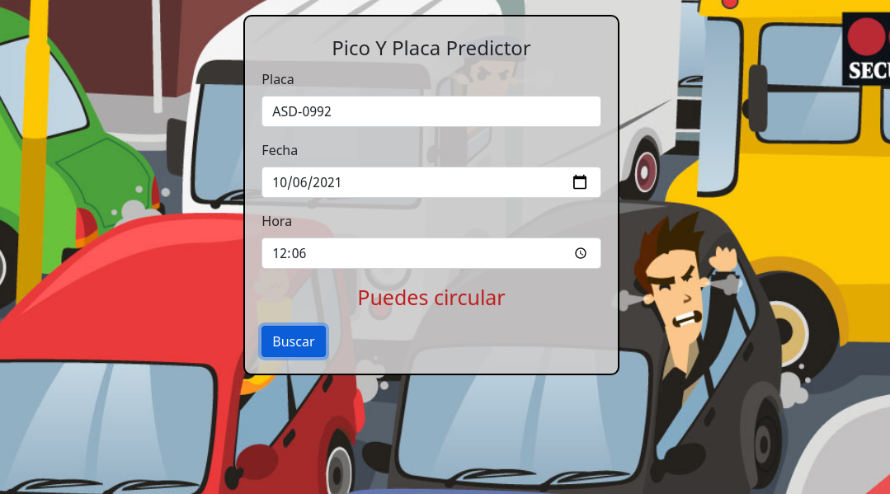

# Pico y Plca Predictor
Es una aplicacion sencilla para predecir pico y placa segun la fecha la hora y el ultimo numero de placa consta de test y version minificada con webpack

## Hecho con

- JavaScript
- Jest
- Webpack

## Información
- ./dist Version minificada de webpack
- ./src  Logica
- ./__tests_ Pruebas

## Live Demo
[Live Demo Link]()

### Test
- `npm run test`

### Prerequisitos

Buscador
Internet

## Autor

👤 **Pablo Alexis Zambrano Coral**
- Github: [@Alexoid1](https://github.com/Alexoid1)
- Twitter: [@Alexis Zambrano_acz](https://twitter.com/pablo_acz)
- Linkedin: [linkedin](https://www.linkedin.com/in/pablo-alexis-zambrano-coral-7a614a189/)

## 🤝 Contribuir

Las Contribuciones son Bienvenidas!

Checa --> [issues page](https://github.com/Alexoid1/Pico-y-Placa-Predictor/issues).

## 📝 Licensia

This project is [MIT]() licensed.
